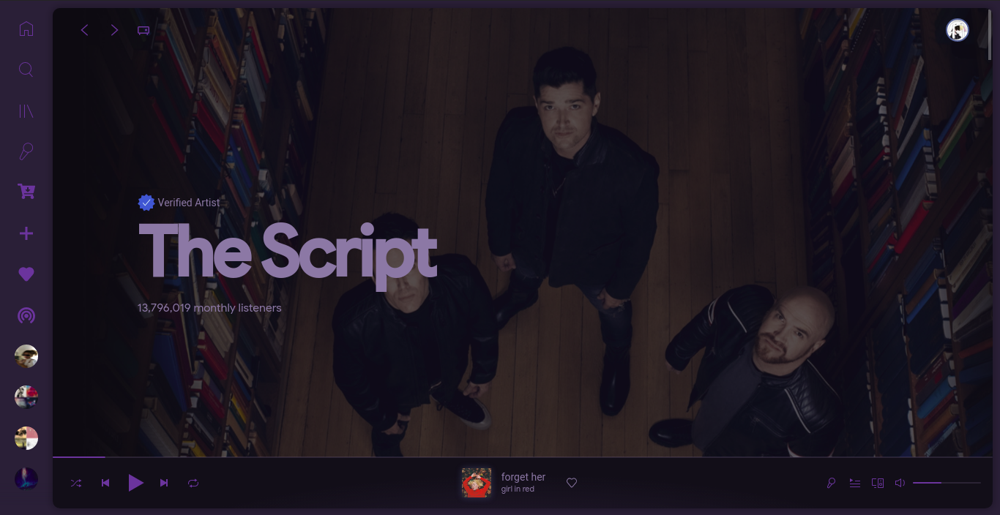

# Dribbblish amethyst recolour, originally made by Khanhas

## NOTE: Contains modified css, not guaranteed to work with other recolours 
### Amethyst

To install, clone the repository, and copy paste the files into a "Dribbblish-amethyst" folder (you'll have to make it) in your spicetify Themes directory. 
Copy the extension over to your spicetify Extensions folder, if it doesn't already exist, there's no difference in the js compared to the original dribbblish.

Then run:
spicetify config extensions dribbblish.js
spicetify config current_theme Dribbblish-amethyst color_scheme amethyst
spicetify config inject_css 1 replace_colors 1 overwrite_assets 1
spicetify apply
